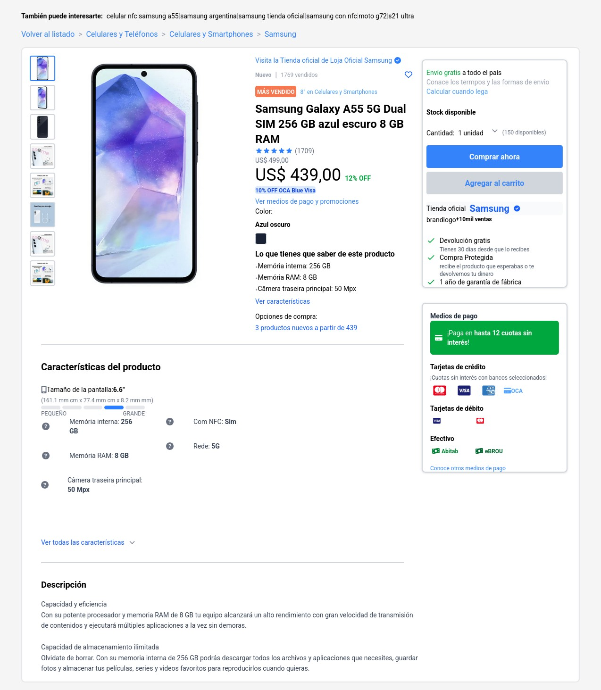

# MercadoLibre Clone

A full-stack e-commerce product detail page inspired by MercadoLibre, built with Go (backend) and Next.js (frontend).

## 🚀 Features

- **Product Detail Page**: Replica of MercadoLibre's product page with all key information
- **RESTful API**: Clean and simple API built with Go standard library
- **Responsive Design**: Mobile-first approach with Tailwind CSS
- **Real-time Data**: Product information, seller details, reviews, and Q&A
- **Performance**: Optimized for fast loading with server-side rendering
- **Testing**: 80%+ test coverage on backend

## 🛠️ Tech Stack

### Backend
- **Go 1.22** - Using only standard library (no external dependencies)
- **JSON** - File-based data persistence
- **RESTful API** - Clean architecture with handlers, repository, and models

### Frontend
- **Next.js 14** - App Router with TypeScript
- **Tailwind CSS** - For styling
- **Axios** - HTTP client for API calls

### DevOps
- **Docker** - Containerization for both services
- **Docker Compose** - Multi-container orchestration
- **GitHub Actions** - CI/CD pipeline

## 📁 Project Structure

```
mercadolibre-clone/
├── backend/              # Go API
│   ├── src/             # Source code
│   │   ├── cmd/         # Application entrypoints
│   │   ├── internal/    # Private application code
│   │   └── pkg/         # Public libraries
│   ├── data/            # JSON data files
│   └── Makefile         # Build automation
├── frontend/            # Next.js application
│   ├── src/            # Source code
│   │   ├── app/        # App router pages
│   │   ├── components/ # React components
│   │   └── services/   # API integration
│   └── public/         # Static assets
├── docker/             # Docker configurations
├── scripts/            # Automation scripts
└── docs/              # Documentation
```

## 🚦 Getting Started

### Prerequisites
- Go 1.22+
- Node.js 20+
- Docker (optional)

### Quick Start

```bash
# Clone the repository
git clone <repository-url>
cd mercadolibre-clone

# Run setup script
chmod +x scripts/*.sh
./scripts/setup.sh

# Start services
# Terminal 1 - Backend
cd backend && make run

# Terminal 2 - Frontend
cd frontend && npm run dev
```

Visit:
- Frontend: http://localhost:3000
- Backend API: http://localhost:8080/api

### Using Docker

```bash
cd docker
docker-compose up --build
```

## 📖 API Documentation

See [docs/API.md](docs/API.md) for complete API documentation.

### Main Endpoints

- `GET /api/products` - List all products
- `GET /api/products/{id}` - Get product details with seller info, reviews, and Q&A
- `GET /api/products/{id}/related` - Get related products

## 🧪 Testing

```bash
# Run all tests
./scripts/test.sh

# Backend tests with coverage
cd backend && make coverage

# Frontend tests
cd frontend && npm test
```

## 📸 Screenshots


*Product detail page showing all key information*

## 🏗️ Architecture Decisions

- **No External Dependencies (Backend)**: Used only Go standard library for simplicity and reduced complexity
- **File-based Storage**: JSON files for data persistence as per requirements
- **Clean Architecture**: Separation of concerns with handlers, repository, and models
- **Server-Side Rendering**: Next.js App Router for better SEO and initial load performance

See [docs/DESIGN_DOCUMENT.md](docs/DESIGN_DOCUMENT.md) for detailed design decisions.

## 🤝 Contributing

1. Fork the repository
2. Create your feature branch (`git checkout -b feature/amazing-feature`)
3. Commit your changes (`git commit -m 'Add some amazing feature'`)
4. Push to the branch (`git push origin feature/amazing-feature`)
5. Open a Pull Request

## 📝 License

This project is licensed under the BSD-3 License - see the LICENSE file for details.

## 🙏 Acknowledgments

- MercadoLibre for the design inspiration
- The Go and Next.js communities for excellent documentation

